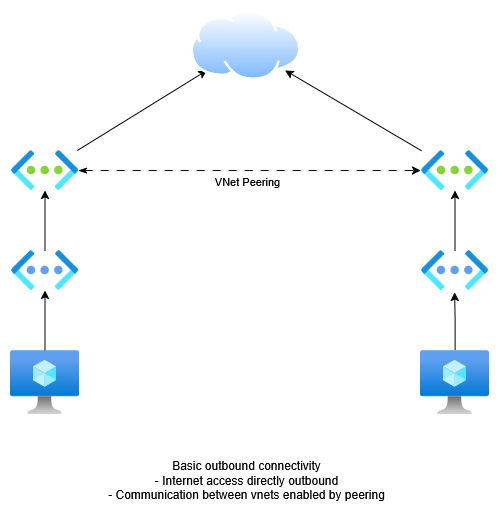
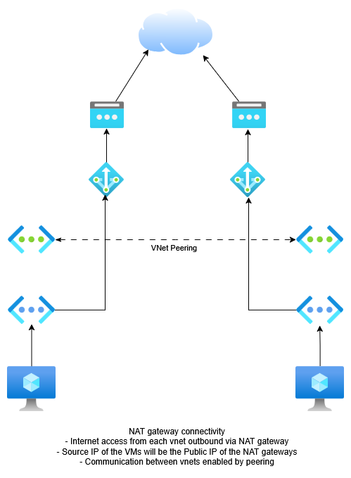
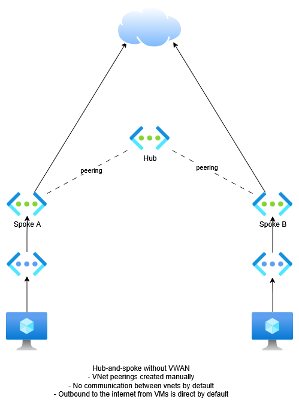
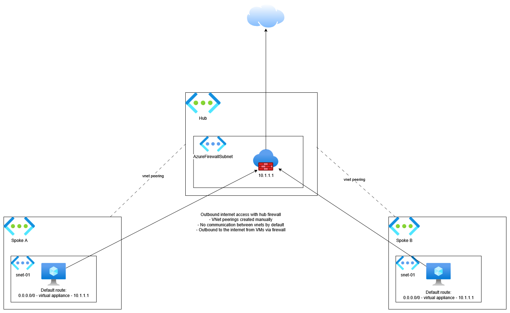

# Basic networking
As standard, outbound internet access for resources connected into an Azure Virtual Network is directly out to the internet, using one of Azure's random outbound public IPs. This is due to be deprecated in September 2025 (https://learn.microsoft.com/en-us/azure/virtual-network/ip-services/default-outbound-access).
Communication between vnets requires a bi-directional peering.

This can be controlled further by adding NAT gateways to each subnet where VMs will access the internet. NAT Gateway allows resources from within the network to connect to the internet whilst remaining fully private, using Source NAT and an assigned public IP.

# Hub-and-spoke networking
For larger networks, it is recommended to configure a hub-and-spoke topology per-region. Hub-and-spoke means having a central "hub" Virtual Network, where core services and network gateways are hosted, and "spoke" vnets connected into it for each application or workload.

Without Azure Virtual WAN, peerings, routing and outbound internet connectivity must be managed by code or config.

For outbound internet access via the hub, some requirements must be met:
1. A Firewall must be deployed and connected to the hub vnet
2. Peerings must exist between the spokes and the hub
3. A default route must be created on each subnet pointing to the firewall

For communication between the 

